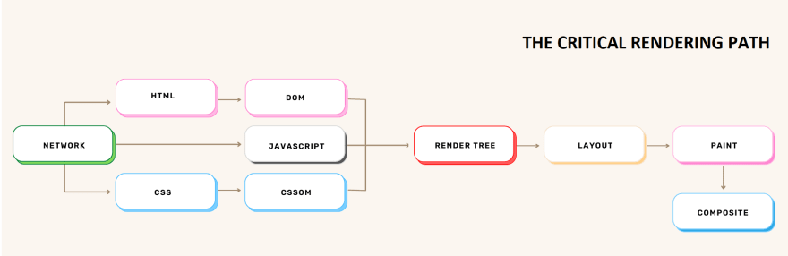

# Browser Rendering

## Introduction

When you open a web page in your browser, a complex process unfolds behind the scenes to transform HTML, CSS, and JavaScript into a visual representation on your screen. Understanding how browsers render these components to the Document Object Model (DOM) is crucial for web developers. This paper delves into the mechanisms involved in the browser rendering process.

## Rendering Pipeline

### 1. Parsing HTML
- The browser parses the HTML document to create a Document Object Model (DOM) tree.
- It identifies HTML tags, attributes, and their relationships to form the structural representation of the page.
- Example:

```
  <!DOCTYPE html>
  <html>
    <head>
      <title>Browser Rendering</title>
      <link rel="stylesheet" href="styles.css">
    </head>
    <body>
      <h1>Welcome to Browser Rendering</h1>
      <p>This is a sample HTML document.</p>
      <script src="script.js"></script>
    </body>
  </html>
```


### 2. Constructing the CSSOM
- Concurrently with HTML parsing, the browser builds the CSS Object Model (CSSOM).
- It resolves styles, inheriting properties and handling conflicts, to determine the final styles for each element.
- Example:
```
body {
  font-family: 'Arial', sans-serif;
  background-color: #f0f0f0;
}

h1 {
  color: #333;
}

p {
  font-size: 16px;
}
```


### 3. Creating the Render Tree
- The browser combines the DOM and CSSOM to create a Render Tree.
- It represents the visual hierarchy of elements with styles applied.
- Example: <br>
Render Tree:
```
- Render View
  - Render Body
    - Render Heading (h1)
      - Text: Welcome to Browser Rendering
    - Render Paragraph (p)
      - Text: This is a sample HTML document.
```


## Conclusion

Understanding the browser rendering process is essential for optimizing web performance and creating a smooth user experience. Developers can utilize this knowledge to write efficient HTML, CSS, and JavaScript, resulting in faster rendering times.

## References

- [HTML Living Standard](https://html.spec.whatwg.org/)
- [CSSOM View Module](https://www.w3.org/TR/cssom-view/)
- [Introduction to the DOM](https://developer.mozilla.org/en-US/docs/Web/API/Document_Object_Model/Introduction)
- [Rendering Performance](https://developers.google.com/web/fundamentals/performance/rendering)